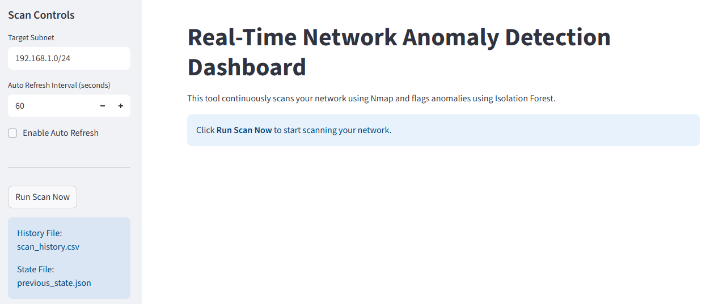
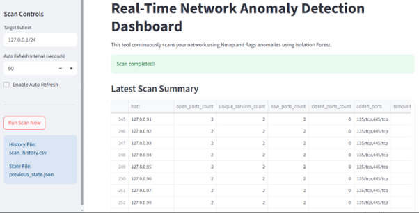
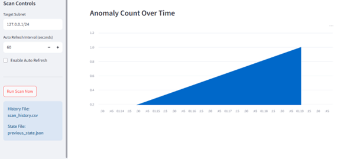
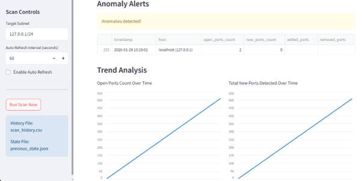

# Real-Time Network Anomaly Detection Dashboard

This project implements a real-time network monitoring and anomaly detection system using Nmap for network scanning and Isolation Forest for anomaly detection. A Streamlit dashboard is used to visualize scan results, detected anomalies, and historical trends.

---

## Live Application (Cloud Deployment)

The application is deployed on Streamlit Cloud and can be accessed here:

https://networkanomalydetection.streamlit.app/

Important note:  
The cloud deployment is provided for demonstration purposes only. Due to cloud environment restrictions (such as limited system-level permissions and network scanning constraints), the application may not perform with full accuracy or stability when deployed online.

---

## Local Execution (Recommended)

For best performance and accurate network scanning, the application should be executed locally.

Running locally allows:
- Full access to Nmap network scanning
- Accurate port and service detection
- Stable anomaly detection results
- Persistent scan history and state tracking

---

## Dashboard Preview

### Home Dashboard


### Latest Scan Summary


### Anomaly Alerts


### Trend Analysis


---

## How to Run Locally

### Prerequisites
- Python 3.9 or higher
- Nmap installed and added to system PATH

### Install Dependencies
```bash
pip install -r requirements.txt
```

### Run the Application
```bash
streamlit run anomaly_detection_app.py
```

## Key Features

Real-time network scanning using Nmap

Host and port change detection

Isolation Forest based anomaly detection

Historical trend analysis

Interactive Streamlit dashboard

## Disclaimer

This project is intended for educational and research purposes only. Network scanning should only be performed on networks you own or have explicit permission to test.

---